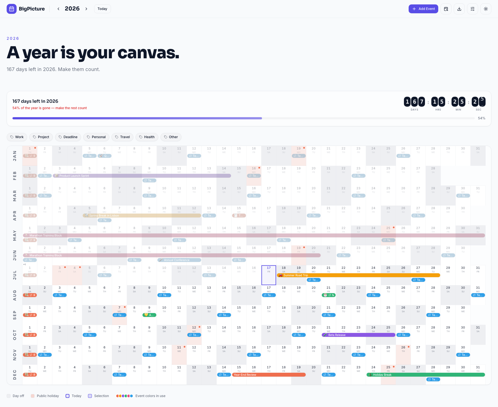
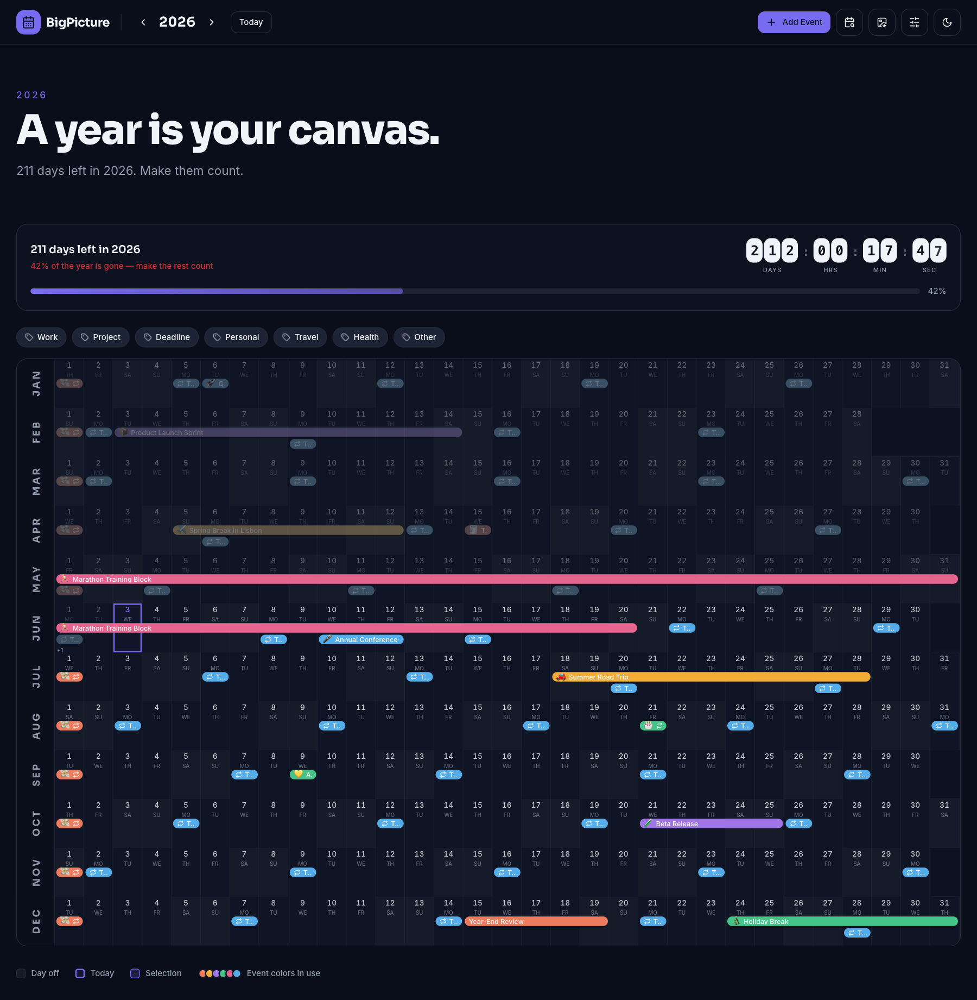
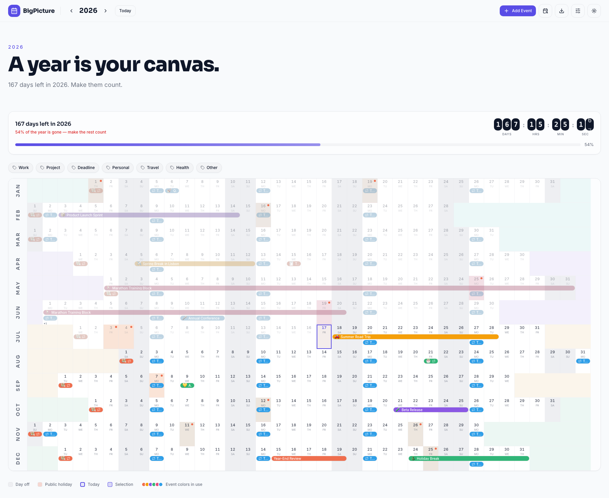

# BigPicture

A beautiful, modern **personal annual calendar** — see your entire year at a glance in a horizontal‑row‑per‑month layout. Plan events, drag to create or reschedule, filter by category, and never lose the big picture.

**🔗 Live demo — [thebigpicture.vercel.app](https://thebigpicture.vercel.app)**

> *A year is your canvas.*

## 📸 Screenshots



<details>
<summary><b>More views</b> — dark mode &amp; fixed‑week layout</summary>

### Dark mode



### Fixed‑week layout with quarter color tones



</details>

---

## ✨ Features

### Layout & viewing
- **Year at a glance** — all 12 months as horizontal rows, responsive cells that fill the available width.
- **Two layouts** — *Date Grid* (continuous day strip) or *Fixed Week* (weekday‑aligned columns, Sunday/Monday start).
- **Density** — Compact / Cozy / Spacious row heights.
- **Color tones** — None / Subtle / Quarter / Monthly background accenting.
- **Public holidays** for 30 countries, marked right on the grid (lazy‑loaded, off by default).
- **Days off**, **ISO week numbers**, **quarter dividers**, and **past‑date dimming** toggles.
- **Vertical month labels** in a sticky left rail.
- **Light & dark themes**, persisted and defaulting to your system preference.

### Events ("stamps")
- Create via **+ Add Event**, by **clicking a day**, or by **dragging across days**.
- **Drag to move/resize** existing events; live preview while dragging.
- **9 colors**, **7 categories**, **emoji**, plus **notes, location, and links**.
- **Recurring events** (daily / weekly / monthly / yearly with interval + end conditions) and **per‑occurrence edits** ("this event" vs "all events").
- **Hover card** — dwell on any stamp to see its dates, notes, location, and a clickable link.
- Up to 3 stacked stamps per day with a "+N" overflow; configurable lane position.

### Productivity & polish
- **Days‑left countdown** with an animated flip‑digit ticker to keep you motivated.
- **Search & jump‑to‑date**.
- **Keyboard shortcuts** — `T` today, `N` new event, `←`/`→` change year, arrow keys + `Enter` on focused day cells.
- **Category filtering** with tag‑style pills.
- **Undo** on every delete, restore, and import.
- **Reset** flow with a clear, guarded confirmation.
- Toast confirmations on every action; everything persists to **localStorage** (schema‑versioned, with validation and migration on load).

### Import & export
- **PNG export** of the whole year grid.
- **Print / save as PDF** — the grid alone, scaled to one landscape page.
- **ICS export** — take your events to Google/Apple Calendar (recurrence maps to RRULE).
- **ICS import** — pull events in from any calendar app (recurring events are skipped for now).
- **JSON backup & restore** — a one‑click snapshot of your events and display settings, restorable on any device.

---

## 🛠 Tech stack

- **React 18** + **Vite** + **TypeScript** (strict)
- **Tailwind CSS** with an HSL‑based, fully tokenized design system (light/dark)
- **shadcn/ui**‑style components (Radix primitives)
- **date-fns** for date logic
- **framer-motion** for the countdown ticker
- **sonner** for toasts · **react-helmet-async** for SEO · **react-router-dom**
- **html-to-image** for PNG export
- **Vitest** for the recurrence, persistence, and ICS test suites

---

## 🚀 Getting started

```bash
# install dependencies
npm install

# start the dev server (http://localhost:5173)
npm run dev

# type-check and build for production
npm run build

# run the test suite
npm test

# preview the production build
npm run preview
```

Requires Node 18+.

---

## 📁 Project structure

```
src/
  components/
    AnnualCalendar.tsx      # top-level orchestrator (state, layout, dialogs)
    CalendarHeader.tsx      # sticky header: year nav, add, export, options, theme
    MonthRow.tsx            # one month row: cells, stamps, lanes, tones
    EventDialog.tsx         # create / edit / delete, recurrence, details
    CategoryFilter.tsx      # tag-style category toggles
    DisplayOptionsDialog.tsx# grouped display settings
    CountdownTicker.tsx     # animated flip-digit countdown
    EmojiPicker.tsx, ThemeToggle.tsx, JumpToDate.tsx, ResetConfirmDialog.tsx
    ui/                     # shadcn-style primitives
  hooks/
    useEvents.ts            # localStorage-backed events store
    useTheme.ts             # light/dark theme
    useDragSelection.ts     # drag-to-create selection
    useEventDrag.ts         # drag-to-move / resize existing events
  lib/
    calendarUtils.ts        # date helpers, recurrence expansion, layout
    persistence.ts          # versioned storage, validation, JSON backups
    ics.ts                  # iCalendar (.ics) export & import
    storage.ts              # throw-safe localStorage wrappers
    download.ts             # client-side file downloads
    types.ts                # CalendarEvent, DisplayOptions, etc.
    sampleEvents.ts         # seed data
  pages/
    Index.tsx, NotFound.tsx
```

Unit tests live next to the code they cover (`src/lib/*.test.ts`) and run with `npm test`.

---

## 🎨 Design system

All colors are defined as **HSL CSS variables** (semantic tokens) in `src/index.css` and mapped in `tailwind.config.ts` — components never hardcode colors. This keeps light/dark theming and the 9 event colors fully consistent.

---

## 🗺 Roadmap

Planned, not yet built:

- Recurring‑event ICS import
- Multiple calendars/layers · year stats / insights
- Cloud persistence with user auth (events across devices)
